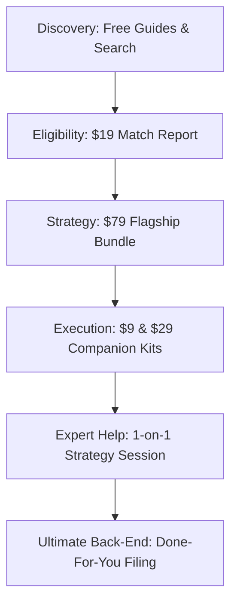

# Co-Founder's Commercial Alignment Plan: Sprint 3 Refinements

This plan refines our monetization positioning to orient around **one unified customer journey** rather than a fragmented catalog of 10 digital products.

---

## 🗺️ The Unified B2B Customer Journey

---

## 🛠️ Code Modification Specifications

### 1. Rebrand the $9 Gated Asset (Guides)
- **File:** [PDFPaywallWidget.tsx](file:///Users/ashwanikumar/Downloads/canadablog/components/blog/PDFPaywallWidget.tsx)
- **Current Text:** *"Funding Approval Library ($9.00)"*
- **Refined Text:** **"Application Companion Kit & Implementation Pack ($9.00)"**
- **Outcome Focus:** Sell saved time, templates, and clarity on program rules rather than static PDF files.

### 2. Rebrand the $29 Thank-You Upsell (Downloads)
- **File:** [OTOUpsellCard.tsx](file:///Users/ashwanikumar/Downloads/canadablog/components/download/OTOUpsellCard.tsx)
- **Current Text:** *"Grant Application Toolkit ($29.00)"*
- **Refined Text:** **"Complete Application Prep Kit & Implementation Pack ($29.00)"**
- **Outcome Focus:** Reframe checklist details from "Excel worksheets" to "Everything you need to compile, check, and submit your claim correctly."

### 3. Reposition the $199/$499 Audits (Strategy Session)
- **File:** [AuditClient.tsx](file:///Users/ashwanikumar/Downloads/canadablog/app/audit/AuditClient.tsx)
- **Current Text:** *"Book Live Eligibility Audit ($199.00)"*
- **Refined Text:** **"Schedule a Live Funding Strategy Review Session ($199.00)"**
- **Outcome Focus:** Pitch certitude and advisory access rather than a diagnostic inspection.

### 4. Move Subscriptions to Post-Purchase Retention
- **File:** [PortfolioClient.tsx](file:///Users/ashwanikumar/Downloads/canadablog/app/portfolio/PortfolioClient.tsx)
- **Action:** Retract raw monthly member subscription buttons from unauthenticated landing states.
- **Rules:** The subscription offer is gated to active accounts that have completed an initial entry purchase, preserving trust during first-touch discovery.

---

## 5. Done-For-You Filing Pipeline
Every page and interaction has been structured to funnel high-scoring applicants directly to the Done-For-You pipeline. High-revenue companies are fast-tracked to schedule their live strategy review, routing premium corporate opportunities directly to compliance writers and claims engineers.
